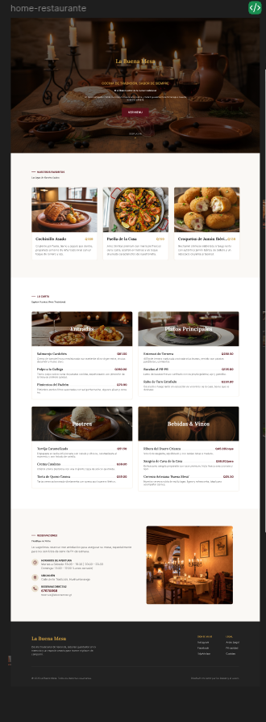
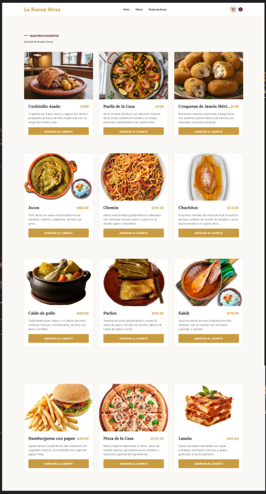
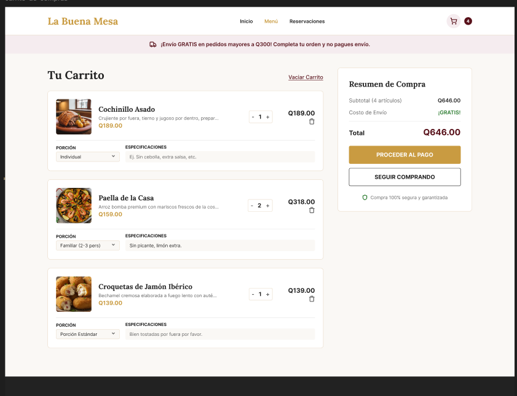
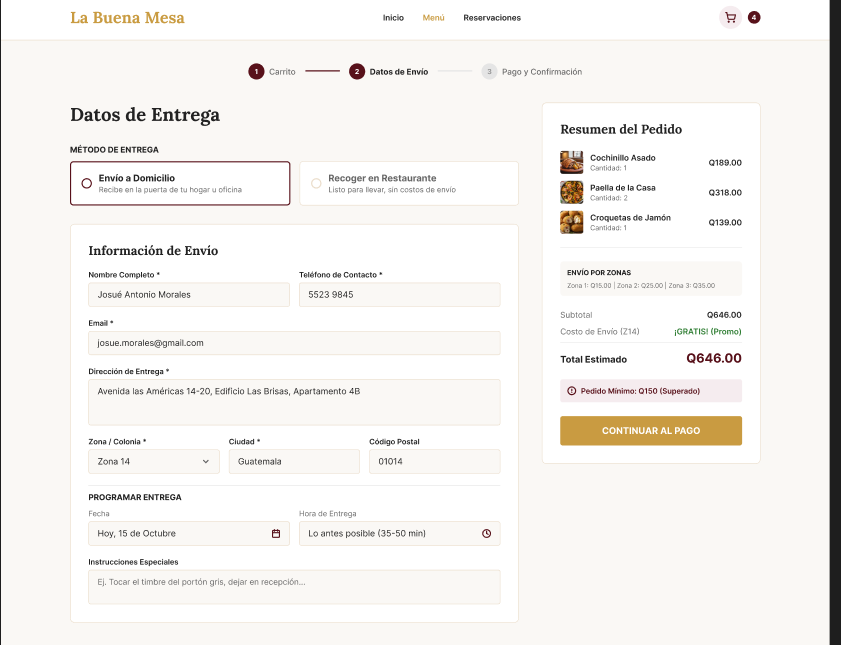
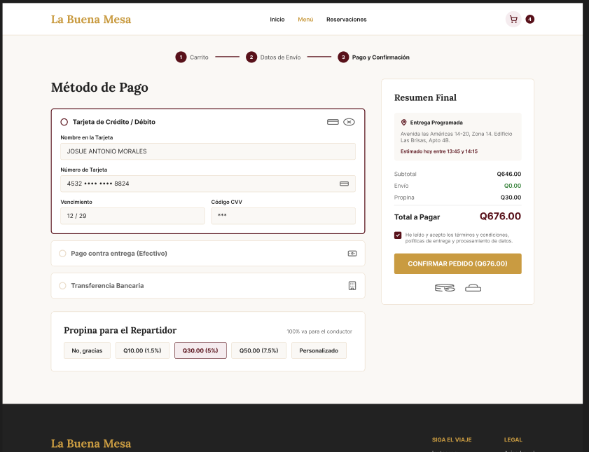

# hola mundo xd

##  Descripción General del Proyecto
* **Proyecto:** Sistema Web de Comida a Domicilio
* **Período:** 31 de Agosto – 15 de Septiembre 2026
* **Objetivo:** Planificar la interfaz, flujos y la estructura relacional de la base de datos para el sistema de pedidos.

# Fase 1: Planificación, Diseño UI/UX y Base de Datos
## Definicion de los alcances y requerimentos
1. pagina principal/Home  => boton de menu
2. Menu
3. Carrito de compras flotante
4. Toma de datos
5. Confirmacion del pedido y datos de pago

## 2. Requerimientos de la Interfaz (UI/UX)
* **Vistas principales:**
  1. Catálogo / Menú de platillos (Home).
  2. Vista de detalle del producto.
  3. Carrito de compras (flotante o sección interactiva).
  4. Formulario de checkout / confirmación de datos del cliente y entrega.

### 1.
    DISEÑO ECHO EN FIGMA https://www.figma.com/design/vBu9SUTUT6xul4ZHcFDUaZ/Restaurante-dise%C3%B1o?node-id=2-4&t=ow19rvHBc5zGFVAK-1

    # home
    

    # menu
    

    # carrito de compras
    

    # toma de datos
    

    # confirmacion de pedidos
    

## 3. Estructura de la Base de Datos (MySQL)
* Tablas planeadas:
  * `usuarios`
  * `categorias`
  * `productos`
  * `pedidos`
  * `detalle_pedido`

  